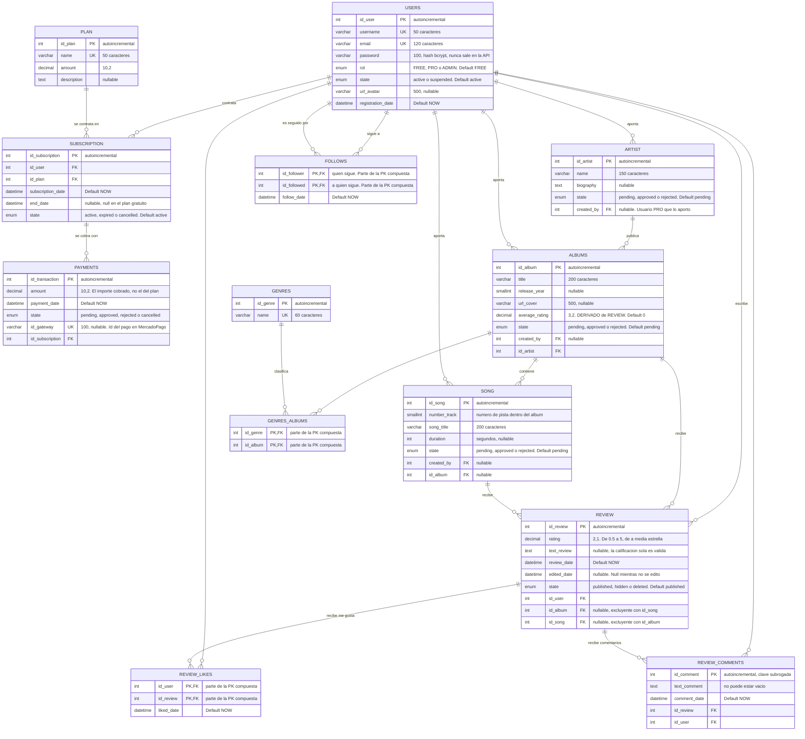

# Diagrama de entidad-relación

Modelo de datos de Musicboxd, tal como está implementado en
[`backend/src/entities/`](../backend/src/entities/).

Está en Mermaid y no como imagen a propósito: se versiona en git junto al código,
se revisa en un pull request como cualquier otro archivo y no se desincroniza del
modelo real. [`docs.md`](../docs.md) admite Mermaid para los diagramas.

Última revisión: **10/09/2026** — 13 tablas.

## Diagrama

`PK,FK` marca las columnas que son parte de una clave primaria compuesta y a la
vez clave foránea. Mermaid no tiene una marca propia para ese caso.

## Restricciones que el diagrama no muestra

Son reglas que viven en la base pero que ninguna notación de DER dibuja:

| Tabla | Restricción | Por qué |
|:-|:-|:-|
| `REVIEW` | Único `(id_user, id_album)` y `(id_user, id_song)` | Un usuario publica a lo sumo una reseña por álbum y una por canción |
| `REVIEW` | `id_album` e `id_song` son **excluyentes**: viene exactamente uno | Una reseña apunta a un álbum *o* a una canción, nunca a las dos ni a ninguna. Se valida a nivel de fila en la entidad |
| `SONG` | Único `(id_album, number_track)` | No puede haber dos pistas 4 en el mismo álbum. Es además la clave natural que usa el seed para ser idempotente |
| `SUBSCRIPTION` | Único `(id_user, id_plan, subscription_date)` | Clave natural: el mismo usuario no contrata dos veces el mismo plan en el mismo instante |
| `PAYMENTS` | Único `id_gateway` | Evita registrar dos veces el mismo pago si MercadoPago reintenta el webhook |
| `FOLLOWS` | La PK compuesta impide seguir dos veces a la misma persona | No hace falta una restricción extra: la propia clave primaria lo garantiza |

## Comportamiento ante borrados

| Relación | Al borrar el padre | Por qué |
|:-|:-|:-|
| `USERS` → `SUBSCRIPTION`, `REVIEW`, `REVIEW_COMMENTS`, `REVIEW_LIKES`, `FOLLOWS` | CASCADE | No significan nada sin el usuario |
| `PLAN` → `SUBSCRIPTION` | RESTRICT | Un plan con suscripciones no se borra: se perdería el historial de facturación |
| `SUBSCRIPTION` → `PAYMENTS` | RESTRICT | Un pago es un hecho contable que ya ocurrió |
| `ARTIST` → `ALBUMS`, `ALBUMS` → `SONG` | RESTRICT | Borrar un artista no puede llevarse su discografía en silencio |
| `ALBUMS` → `REVIEW` | RESTRICT | Ídem con las reseñas de la comunidad |
| `REVIEW` → `REVIEW_COMMENTS`, `REVIEW_LIKES` | CASCADE | `REVIEW_COMMENTS` es una entidad débil: no existe sin su reseña |
| `USERS` → `ARTIST`, `ALBUMS`, `SONG` (`created_by`) | SET NULL | El aporte sobrevive a la baja de quien lo cargó y queda sin autor registrado |

En la práctica el CASCADE sobre `USERS` casi nunca dispara: la baja de un usuario
es **lógica** (`state = 'suspended'`), no un `DELETE`.

## Ajustes sobre el DER original

Lo que cambió desde el diagrama aprobado con la propuesta. El detalle y la
justificación de cada uno están en [`proposal.md`](../proposal.md).

### Entidades y relaciones nuevas

| Estructura | Qué es | Cuándo entró |
|:-|:-|:-|
| `REVIEW_LIKES` | N:M entre `USERS` y `REVIEW`, con PK compuesta y `liked_date` | PR #11 |
| `REVIEW_COMMENTS` | Entidad **débil** dependiente de `REVIEW`, con clave subrogada `id_comment` | PR #11 |
| `FOLLOWS` | N:M **recursiva** de `USERS` consigo misma, con PK compuesta y `follow_date` | CUU 4 |

`FOLLOWS` es la única relación recursiva del modelo: sus dos claves foráneas
apuntan a la misma tabla, y por eso cada una lleva el nombre de su rol en la
relación (`id_follower` y `id_followed`) y no el de la tabla. El seguimiento es
**unidireccional**, así que no lleva ningún atributo de estado: la fila existe o
no existe.

### Atributos agregados

| Entidad | Atributos |
|:-|:-|
| `USERS` | `state`, `url_avatar`. Además `rol` se define como `FREE / PRO / ADMIN` |
| `ARTIST`, `ALBUMS`, `SONG` | `state` y `created_by`, para el circuito de aporte y moderación del CUU 3 |
| `ALBUMS` | `average_rating`, atributo **derivado**: se recalcula al crear, editar, borrar, ocultar o restaurar una reseña |
| `REVIEW` | `edited_date` y `state` |
| `SUBSCRIPTION` | `end_date` y `state` |
| `PAYMENTS` | `id_gateway`, el id del pago en MercadoPago |

### Lo que NO se agregó

No hay ninguna columna para el id externo de Deezer en `ARTIST`, `ALBUMS`, `SONG`
ni `GENRES`. La idempotencia del seed se resuelve por la clave natural de cada
registro: el género por su nombre, el álbum por título más artista, y la canción
por su número de pista dentro del álbum. Es lo que mantiene el modelo fiel al
pasaje a tablas del DER.
